# AWS Student Registration Web Application

A PHP-based student registration web application deployed on **Amazon EC2** and connected to **Amazon RDS for MySQL** inside a custom Amazon VPC. This hands-on project demonstrates foundational AWS networking, compute, database connectivity, and web application deployment.

> **Current status:** The application was deployed and tested during the project. The AWS resources were subsequently deleted to avoid ongoing charges, so the live endpoint is no longer expected to be available.

## Architecture

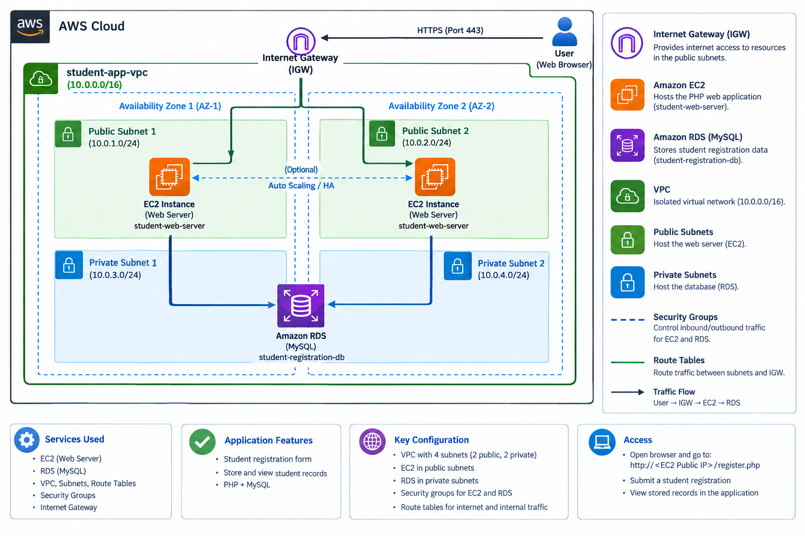

The intended application traffic flow is:

1. A user opens the web application in a browser.
2. Traffic reaches the PHP application hosted on an EC2 instance in a public subnet.
3. The application connects to Amazon RDS for MySQL on TCP port **3306**.
4. The database is placed in private subnets and is not intended to be directly reachable from the public internet.

The diagram illustrates a VPC with two public and two private subnets across two Availability Zones. The actual deployment screenshots confirm a custom VPC, four subnets, route tables, one EC2 web server, and an RDS MySQL instance. The second EC2 instance and Auto Scaling/high-availability path shown in the diagram are **optional design concepts**, not confirmed as deployed resources.

## Application screenshots

### 1. Registration form and success message

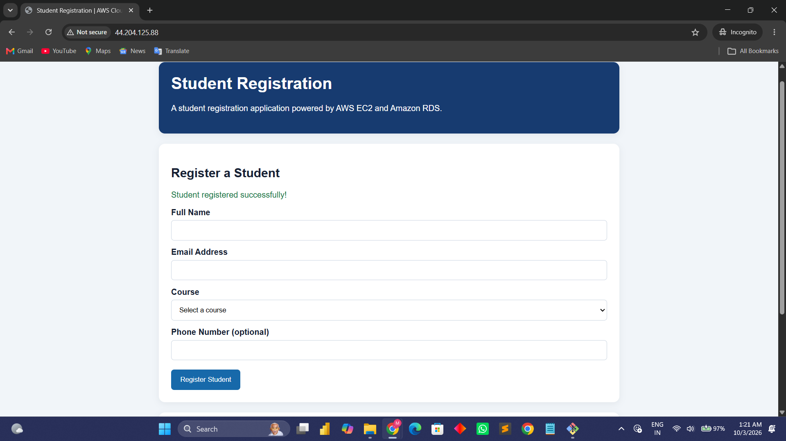

The PHP application provides fields for a student's name, email address, course, and optional phone number. The screenshot shows a successful registration message.

### 2. Registered students

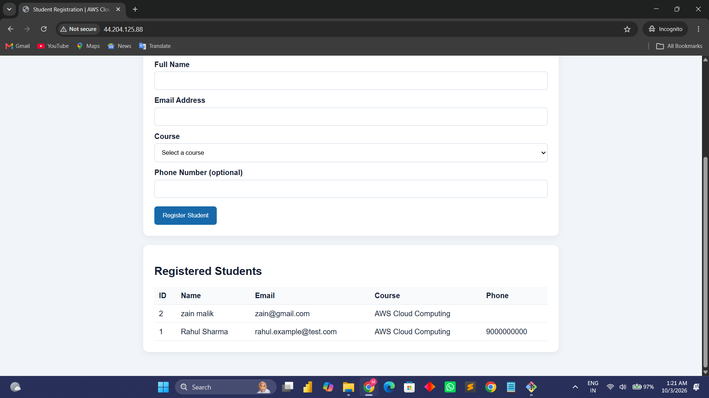

The application displays stored student records in a table, including ID, name, email, course, and phone number.

## AWS implementation evidence

### 3. EC2 web server

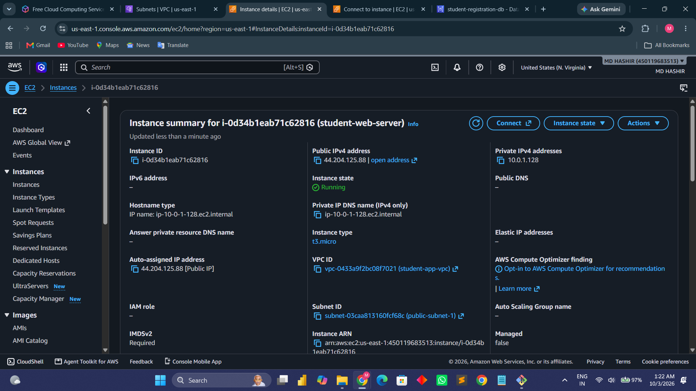

The EC2 console screenshot shows the `student-web-server` instance in the custom VPC. The instance type shown is `t3.micro`.

### 4. Custom VPC

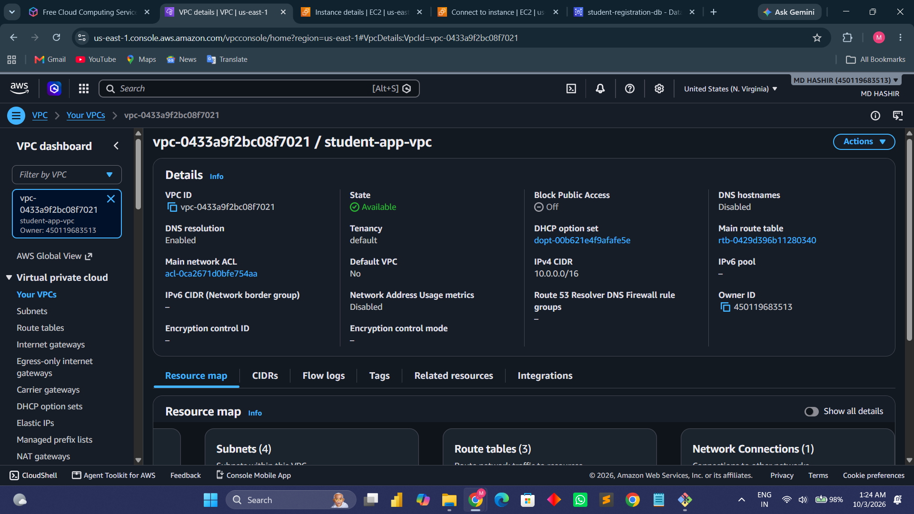

The VPC is named `student-app-vpc` and uses the IPv4 CIDR block `10.0.0.0/16`.

### 5. VPC resource map

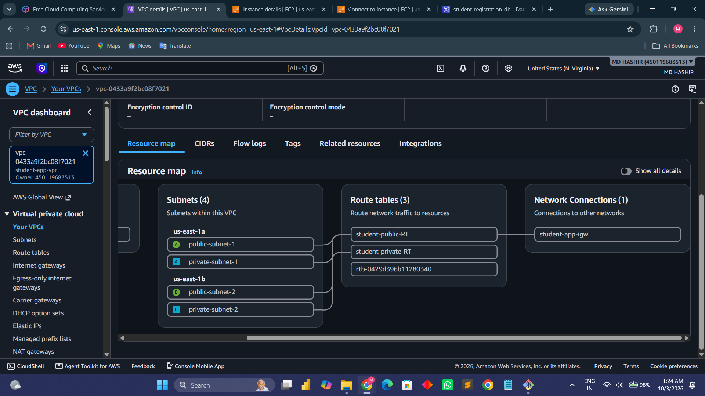

The resource map shows four subnets, route tables, and an Internet Gateway connection.

### 6. Subnet layout

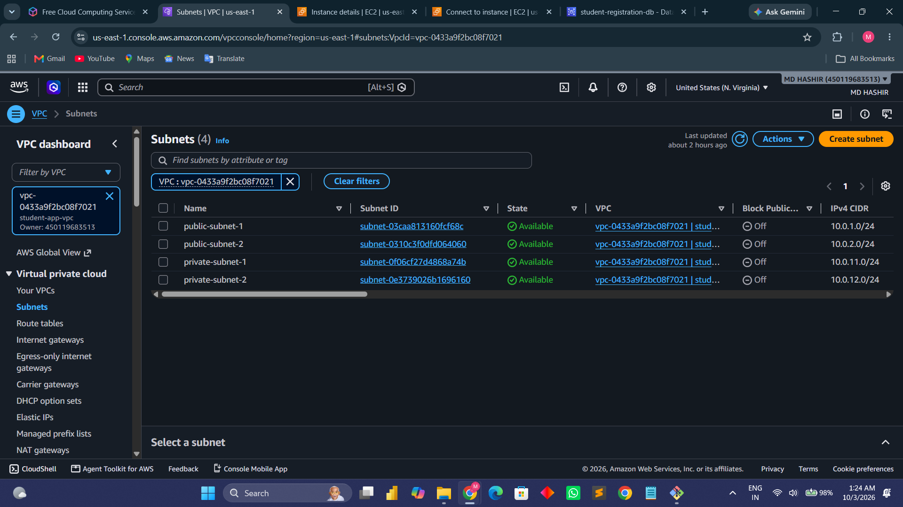

The console lists two public subnets and two private subnets. The subnet CIDRs visible in this screenshot are:

| Subnet | IPv4 CIDR |
|---|---|
| `public-subnet-1` | `10.0.1.0/24` |
| `public-subnet-2` | `10.0.2.0/24` |
| `private-subnet-1` | `10.0.11.0/24` |
| `private-subnet-2` | `10.0.12.0/24` |

These observed subnet CIDRs differ from the private subnet CIDRs drawn in the architecture illustration; this README follows the AWS console evidence for the actual deployment.

### 7. Route tables

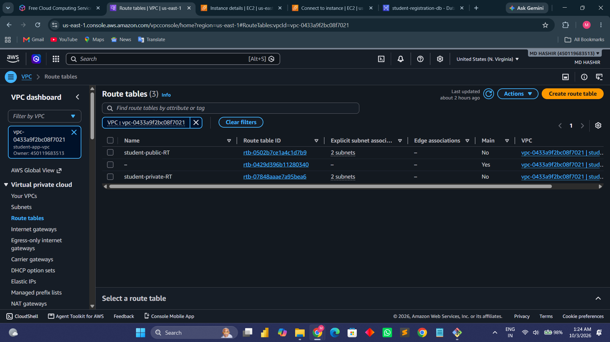

The VPC contains a `student-public-RT` route table and a `student-private-RT` route table, along with the main route table.

### 8. RDS security group

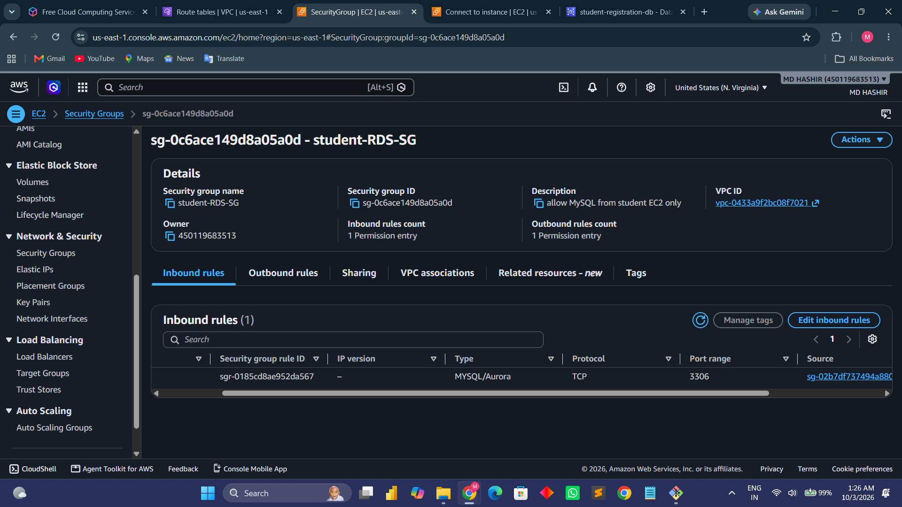

The security group is named `student-RDS-SG`. Its description states that MySQL access is allowed from the student EC2 instance. The visible inbound rule uses MySQL/Aurora TCP port `3306`.

### 9. Amazon RDS for MySQL

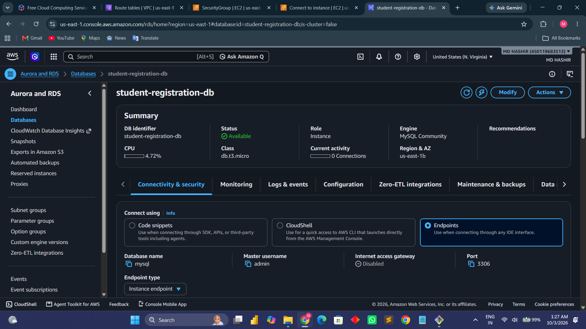

The RDS console screenshot identifies the database instance as `student-registration-db`, using the MySQL Community engine. The screenshot shows database name `mysql` and port `3306`. No database passwords or connection secrets are included in this documentation.

### 10. SQL verification

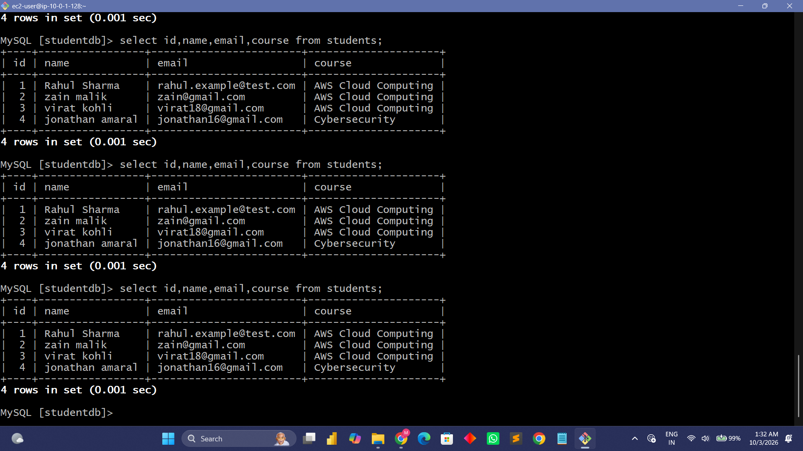

The terminal screenshot shows a query against the `students` table returning four records. This provides evidence that student data was stored in and retrieved from MySQL during testing.

## AWS services and technologies

- **Amazon VPC:** Custom network boundary for the application.
- **Public and private subnets:** Network segmentation for the web and database tiers.
- **Amazon EC2:** Hosts the PHP web application.
- **Amazon RDS for MySQL:** Managed relational database for student records.
- **Internet Gateway and route tables:** Provide internet routing for the public tier and route organization within the VPC.
- **Security groups:** Control traffic to the EC2 instance and database.
- **PHP, HTML, CSS, and MySQL:** Application and database technologies.

## Application workflow

1. The user opens the registration page in a browser.
2. The user enters student details and submits the form.
3. The PHP application processes the submission.
4. The application writes the student record to MySQL on Amazon RDS.
5. The application displays a success message and lists registered students.

## Deployment overview

The following is a high-level summary of the deployment performed for this project. Exact commands and configuration values should be added only after checking the original application files and setup notes.

1. Created a custom VPC named `student-app-vpc`.
2. Created two public subnets and two private subnets.
3. Configured route tables and an Internet Gateway for the public network path.
4. Launched an EC2 instance named `student-web-server` for the PHP application.
5. Created an Amazon RDS for MySQL instance named `student-registration-db`.
6. Configured the database security group to allow MySQL traffic from the EC2 security group.
7. Connected the PHP application to the database and tested student registration.
8. Verified that student records could be queried from MySQL.
9. Deleted the AWS resources after testing to avoid ongoing charges.

## Security notes

- Never commit AWS access keys, private keys, database passwords, session secrets, or `.env` files containing secrets.
- Keep the RDS database private and permit port `3306` only from the application server's security group.
- Restrict web-server inbound access to the required ports and trusted sources where practical.
- The application screenshot uses HTTP and the browser labels the connection “Not secure.” HTTPS/TLS was not demonstrated in the supplied evidence and is a potential improvement.
- Use environment variables or a protected configuration file for database credentials rather than hard-coding secrets in public source code.
- Screenshots may expose account or infrastructure identifiers. Review and redact identifiers before publishing if desired.

## Cost management

The AWS resources were removed after testing to avoid continued charges. Recreating the environment may incur charges depending on the resources, region, and usage. Check current AWS pricing and billing before deploying again.

## Skills demonstrated

- Creating and organizing a custom VPC
- Working with public and private subnets
- Configuring route tables and an Internet Gateway
- Launching and inspecting an EC2 instance
- Deploying a PHP application
- Configuring Amazon RDS for MySQL
- Restricting database access with security groups
- Connecting a web application to a relational database
- Testing inserts and queries in MySQL
- Documenting cloud architecture and implementation evidence

## Possible future improvements

- Configure HTTPS using a certificate and a suitable endpoint.
- Move database credentials to a safer secrets-management approach.
- Add input validation, error handling, and protection against SQL injection using parameterized queries.
- Add backups, monitoring, and logging.
- If high availability is required, design and test a load-balanced, multi-AZ architecture rather than implying that the optional second web server is already deployed.

## Repository structure

```text
aws-student-registration-app/
├── README.md
├── screenshots/
│   ├── 01-architecture-diagram.png
│   ├── 02-application-registration-success.png
│   ├── 03-registered-students-table.png
│   ├── 04-ec2-instance-details.png
│   ├── 05-vpc-details.png
│   ├── 06-vpc-resource-map.png
│   ├── 07-vpc-subnets.png
│   ├── 08-vpc-route-tables.png
│   ├── 09-rds-security-group.png
│   ├── 10-rds-mysql-instance.png
│   └── 11-mysql-query-results.png
└── src/
    └── (add the PHP application files)
```

> **Before publishing:** Add your actual PHP/HTML/CSS source files to the repository and review them for credentials and personal data. The `src/` directory above is a suggested structure; create it only if you choose to organize your application files that way.
